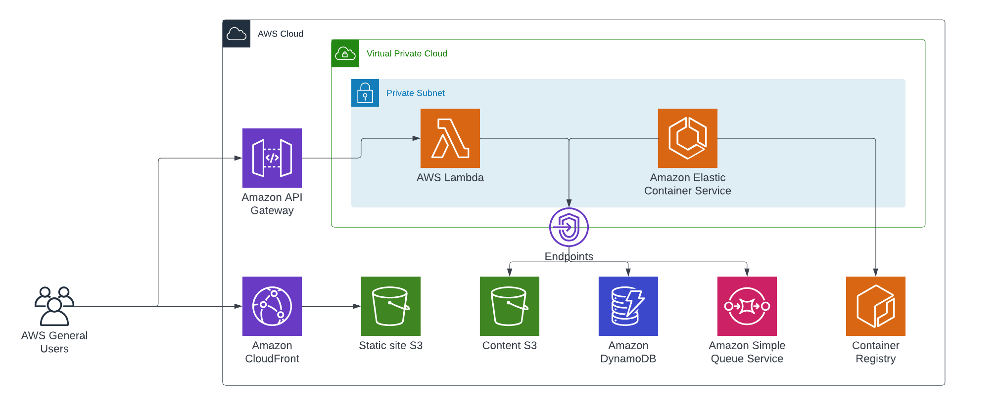

# AWS Startup Loft "my first serverless zipper"

This repo is part of the startup loft session by Firemind and AWS: https://aws-startup-lofts.com/emea/e/0fe78/aws-startup-academy-are-serverless-containers-right-for-you-running-container-applications-on-ecs-at-scale-no-servers-required-feat-firemind



## TL;DR, how to deploy

Run these commands...
```
terraform -chdir=$(pwd)/infrastructure/terraform/ \
  init \
  -backend-config="bucket=firemind-dev-terraform-states" \
  -backend-config="key=startup-loft-zipper.tfstate" \
  -backend-config="region=eu-west-1"

TF_VAR_REGION=eu-west-1 \
TF_VAR_SERVICE=awssup-zipper \
TF_VAR_STAGE=development \
terraform -chdir=$(pwd)/infrastructure/terraform/ plan

TF_VAR_REGION=eu-west-1 \
TF_VAR_SERVICE=awssup-zipper \
TF_VAR_STAGE=development \
terraform -chdir=$(pwd)/infrastructure/terraform/ apply

TF_VAR_REGION=eu-west-1 \
TF_VAR_SERVICE=awssup-zipper \
TF_VAR_STAGE=development \
terraform -chdir=$(pwd)/infrastructure/terraform output -json | jq 'with_entries(.value |= .value)' > $(pwd)/infrastructure/terraform-state.json

AWS_DEFAULT_REGION=eu-west-1 bash ./setup-scripts/docker-deploy.sh

AWS_DEFAULT_REGION=eu-west-1 AWS_SDK_LOAD_CONFIG=1 npm run serverless -- deploy

AWS_REGION=eu-west-1 aws s3 sync src/client/ s3://$(cat $(pwd)/infrastructure/terraform-state.json| jq -r '.s3_bucket_site')
```
